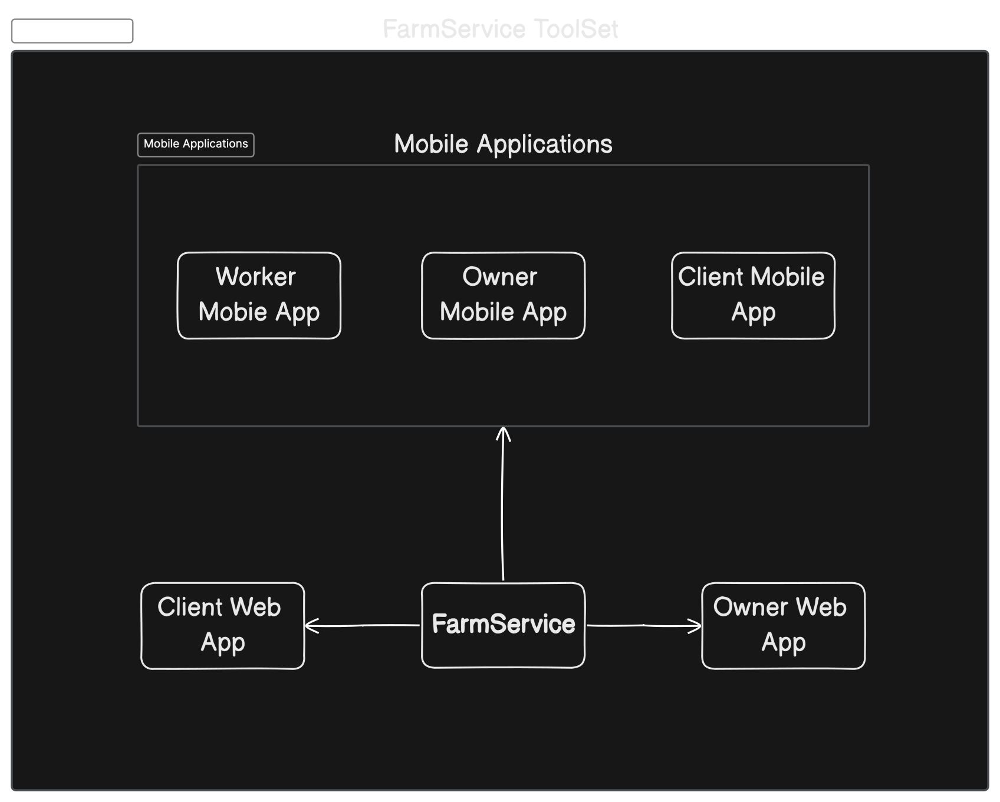

# FarmService Owner Mobile App [Front-end]

 
 

## Table of contents
* [It's still under construction 🚧](#its-still-under-construction)
* [What is FarmService Tool Set](#farmservice---best-toolset-for-handling-agricultural-services)
* [About FarmService Owner ](#farmservice-owner)

 
 

## It's still under construction
Dear friend,

I'm delighted to see you here 😌. This app is a part of the FarmService Tool Set, which you can read more about [here](#farmservice---best-toolset-for-handling-agricultural-services). As I'm the sole contributor to this project, it's currently under development and will be available soon. All completed features will be marked with ✅.

 
 

## FarmService - Best ToolSet For Handling Agricultural Services
FarmService comprises a collection of applications designed to facilitate the management of agricultural service orders within your company.

## FarmService Toolset Schema

For further information about the FarmService Tool Set, please visit  <a href='https://github.com/PwGawzynski/FarmServiceToolSet/tree/main'>this link</a>.

## FarmService Owner
This repository contains the FarmService Owner mobile app, a multiplatform application designed for use on both iOS and Android devices. Its primary goal is to streamline work within agricultural service companies, constituting a segment of the FarmService Tool Set. The FarmService Owner app offers solutions to simplify work processes, enhance team performance, and improve communication among team members.

The app is tailored to manage three fundamental components in the agricultural service delivery process: orders, fields, and workers.

 
 
 

### It provides features like: 

 
 
 

#### Account and sesion manage: 

Accounts are created using an internal identity system, allowing the use of a single account across all FarmService tools. The process is designed to be user-friendly and seamless.

 

Easy and invisible for user

https://github.com/PwGawzynski/FSFR/assets/80092350/9290e331-f4d4-4796-bb7a-5985ceebca3e

#### Notifications with filters
The platform introduces the ability to search among all ever saved orders, using filters 

https://github.com/PwGawzynski/FSFR/assets/80092350/8488a88e-8391-48b3-bfa9-d096082a0c3e

#### Upcoming Orders
The "Upcoming Orders" screen is one of the initial screens seen by the user. It allows the user to preview future orders and serves as a starting point for actions related to orders.

https://github.com/PwGawzynski/FSFR/assets/80092350/c634faa7-be74-439d-94f4-337671d99c84

#### Orders History With filtration
This feature enables users to review order execution history and provides search capabilities through text and filters.

https://github.com/PwGawzynski/FSFR/assets/80092350/540efd3c-14d1-4318-a58c-e2eae5af918b

#### Swipe Navigation
Gesture-based navigation simplifies app navigation.

https://github.com/PwGawzynski/FSFR/assets/80092350/abde18d6-b0d0-4738-894a-1539b7222c1f

#### Creating new order
Adding a new order is made as straightforward as possible, enabling quick addition and subsequent detailed modifications. The system includes validation, along with a quick customer search in the database.

https://github.com/PwGawzynski/FSFR/assets/80092350/2d6d4050-c628-46ca-aef8-25c97855beb5

####  Assigning tasks to employees 
Employee management is a comprehensive feature. After entering an order, the owner can view assigned employees, their tasks, add new employees, and assign them tasks. The feature incorporates advanced animations and haptic feedback.

https://github.com/PwGawzynski/FSFR/assets/80092350/35ebafee-46b8-4918-b6ed-e997c4b0a3e0

#### Close order and request confiramtion action 
Critical data is archived by default, and a global warning screen protects critical actions from accidental execution. 

https://github.com/PwGawzynski/FSFR/assets/80092350/c6fca216-ba76-4f8a-8573-a5d372e65668

#### Accounting
The billing section allows you to quickly calculate the price of an order without saving it and finally settle the order after which the backend will send an invoice to the customer's email.

https://github.com/PwGawzynski/FSFR/assets/80092350/36ce47ba-b827-4ec4-a70b-1d8bf2834105

#### Sending Invoice via mail 
Introduced the ability to send billing proforma emails directly from the user's email inbox.

https://github.com/PwGawzynski/FSFR/assets/80092350/613f7d2c-a673-459c-a2ea-decf972fd50b

#### Printing invoices from App
This feature allows you to print a pro forma billing directly from your phone.

https://github.com/PwGawzynski/FSFR/assets/80092350/33b6448d-091f-41f7-bec0-ba5ddba10bb9

#### Workers List
Allows you to display all employees.

https://github.com/PwGawzynski/FSFR/assets/80092350/5e7093dc-e50a-435f-8c05-99e02789f4c5

#### Workers search engine 
Advanced search for employees was introduced.

https://github.com/PwGawzynski/FSFR/assets/80092350/4264bea3-d427-46f4-9af9-348f184b781d

#### Workers Details mail and call directly from app 
The application provides a preview of the employee's data and a quick way to contact them both by sending an email and calling them with one click.

https://github.com/PwGawzynski/FSFR/assets/80092350/b67a7572-938f-481b-9b07-ffb815964785

